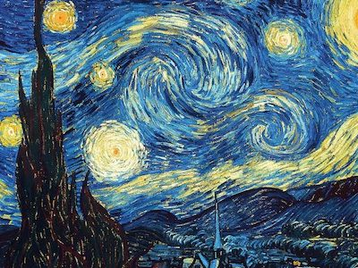
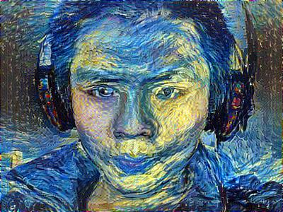
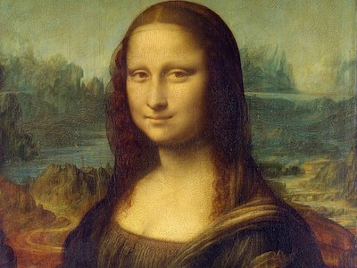
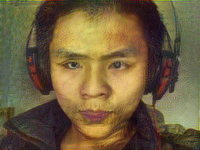

# README

Transfers style from one picture to another.

Original image  

## Style: Van Gogh
Style image  
  
Generated image  

## Style: Leonardo da Vinci
Style image  
  
Generated image  

## Usage
Firstly, install the dependencies  
<code>
  pip3 install -r requirements.txt
</code>
 
Then,<a href='http://www.vlfeat.org/matconvnet/pretrained/#downloading-the-pre-trained-models'> download the pretrianed vgg-19 model </a>  .
Search <code>imagenet-vgg-verydeep-19</code> in this page and download <code>imagenet-vgg-verydeep-19.mat</code>. 
In main.py 
 
Change these variables:
 
<ul>
  <li> path_model </li>
  <li> path_content </li>
  <li> path_style </li>
</ul>
 
To the path of it's corresponding file (pretrained vgg-19 model, content image and style image)  
And then  
<code>
  python3 main.py
</code>
 

